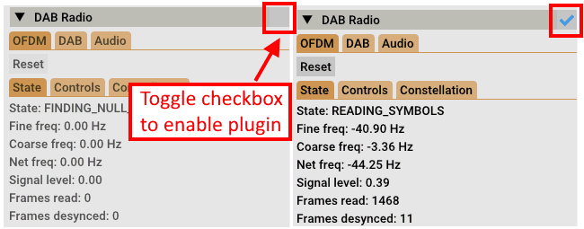
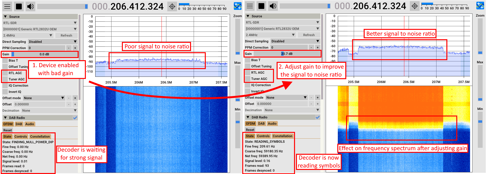
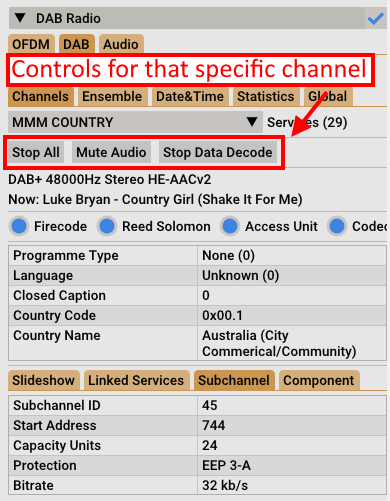
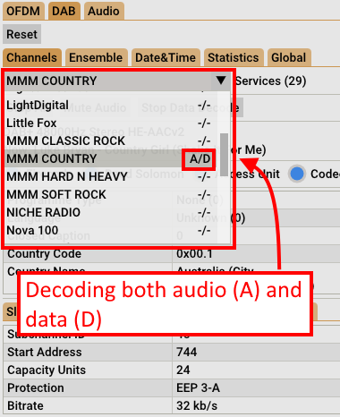
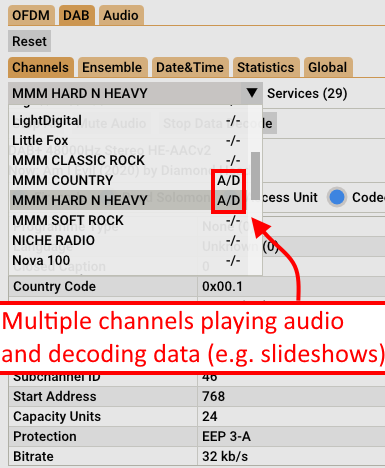
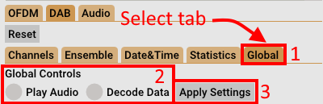
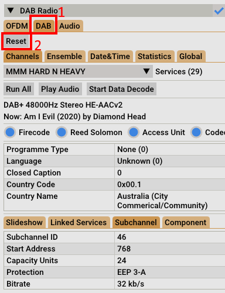

## Introduction
[](https://github.com/williamyang98/SDRPlusPlus-DAB-Radio-Plugin/actions/workflows/x86-windows.yml)
[](https://github.com/williamyang98/SDRPlusPlus-DAB-Radio-Plugin/actions/workflows/x86-ubuntu.yml)
[](https://github.com/williamyang98/SDRPlusPlus-DAB-Radio-Plugin/actions/workflows/x86-macos.yml)
[](https://github.com/williamyang98/SDRPlusPlus-DAB-Radio-Plugin/actions/workflows/arm-macos.yml)

SDR++ DAB radio plugin. 

Before installing this plugin, make sure that your version of SDR++ is the same as the one in ```vendor/sdrplusplus```. If it isn't refer to the build instructions to compile for your version of SDR++.

https://github.com/williamyang98/SDRPlusPlus-DAB-Radio-Plugin/assets/21079869/4625d888-87d6-43cf-8426-b0a7e5cffaf4

Core algorithms for DAB radio are used from https://github.com/williamyang98/DAB-Radio.

SDR++ is at https://github.com/AlexandreRouma/SDRPlusPlus/tree/master/core.

| Directory | Description |
| --- | --- |
| src | Plugin code to use dab algorithms as a SDR++ plugin |
| vendor | third party dependencies for dab code |
| vendor/sdrplusplus | SDR++ core library used to link against for DLL module |
| vendor/DAB-Radio | Core algorithms used for DAB radio decoding |
| cmake | Find*.cmake files for third party cmake targets |

## Download instructions
Download from releases page or build using the instructions below. Make sure you download the correct version if available.

## Installation instructions
### Windows
1. Paste ```dab_plugin.dll``` into ```modules/``` folder inside your SDR++ install.
2. Open SDR++.
3. Inside ```Module Manager``` tab on the left panel add ```dab_decoder``` as a plugin.
4. Browse to a valid DAB frequency using the following link: https://www.wohnort.org/dab/.
5. Check the OFDM/State tab to see if the OFDM demodulator is active.
6. Select the DAB/Channels tab and select one of the DAB+ channels.
7. If no sound is present, check the ```Sinks``` tab and make sure that ```DAB Radio``` is set to ```Audio``` and to the correct audio device.
8. You may also copy ```fftw3f.dll``` into the main SDR++ folder since it is compiled with AVX2 which may improve performance. Be sure to backup the original file before replacing it.

Refer to the build instructions if your processor doesn't support AVX2 instructions to compile with SSE2 or AVX instructions.

### Build instructions for other platforms
Refer to ```toolchains/*/README.md``` for build instructions for your specific platform ```*```. The github workflows in ```.github/workflows``` can also be used as a reference for a working build setup.

## Usage instructions
### 1. Enabling the plugin


### 2. Adjusting the gain to decode signal


### 3. Controls for a single channel


If the channel isn't playing music or downloading slideshows you can press ```Run all``` to activate that channel.
If you want to mute the channel you can press ```Mute audio``` or ```Stop all```. 
These apply to that specific channel only.

### 4. Previewing active channels in list

If you have channels playing music or downloading data (slideshow images) you can see the ```A/D``` status label next to the channel name in the menu.



If there are multiple channels playing audio you can see the ```A/D``` status label next to multiple channel names in the menu dropdown.

### 5. Muting all channels



If you want mute all channels you can go to the ```Global``` tab, select settings to disable audio playback and apply them. 

Then go the specific channel you want playing and **only** enable audio playback for it. Hopefully this helps with any audio playback problems that you might have.

### 6. Changing frequencies



If you are changing frequencies you need to reset the ```DAB``` decoding block since it isn't aware of frequency changes. Go to the ```DAB``` tab and press the ```Reset``` button to reset the DAB decoding to see new channel entries for that specific frequency.

## TODO
- Improve the user interface so that you can view as much information as the original GUI found [here](https://github.com/williamyang98/DAB-Radio).
- Improve integration with SDR++.
- Determine how to make this build crossplatform with all the necessary dependencies.
